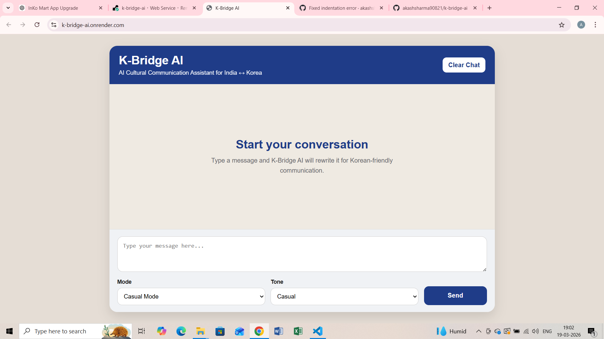

# 🌏 K-Bridge AI

AI Cultural Communication Assistant for India ↔ Korea

## 🚀 Live Demo
https://k-bridge-ai.onrender.com/

## 💡 Features
- Convert casual messages into Korean-friendly communication
- Tone selection (Casual / Polite / Formal)
- Mode selection (Friend / Workplace / Normal)
- Cultural explanation for each message
- Korean translation output
- Chat-style UI with message history

## 🛠 Tech Stack
- Python (Flask)
- HTML, CSS
- Session-based chat memory
- Deployed on Render

## 📸 Screenshot

## 🎯 Purpose
This project helps bridge communication gaps between Indian and Korean users by making messages culturally appropriate and respectful.

---

Made with ❤️ by Akash
